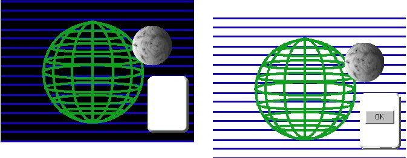

<div align="center">

## Super Transparent Form using my FREE C\+\+ DLL


</div>

### Description

I made some modifications from My previous entry. Fixed the output.txt problem. It was in the OCX file

Source included = OCX,DLL and Sample .EXE

DLL SOURCE INCLUDED!!!! FREE. FAST. Easy.

This is a port from Chris Yates code

(Awesome)

Make Transparent Forms using pictures. SUPER FAST AND EFFICIENT.

Now you can select the Transparent color. Example EXE to show how it is done.

No DLL Calls. Use my TransRegion ActiveX to run the TransRegion.Dll

REAL easy and it is Royalty free.

Please vote for me.
 
### More Info
 
Just put the control on the form and put a picture in the control.

an AWESOME FORM

None so far.


<span>             |<span>
---                |---
**Submitted On**   |2000-07-18 12:10:16
**By**             |[Shawn Elliott](https://github.com/Planet-Source-Code/PSCIndex/blob/master/ByAuthor/shawn-elliott.md)
**Level**          |Intermediate
**User Rating**    |5.0 (20 globes from 4 users)
**Compatibility**  |VB 3\.0, VB 4\.0 \(16\-bit\), VB 4\.0 \(32\-bit\), VB 5\.0, VB 6\.0, VB Script, ASP \(Active Server Pages\) 
**Category**       |[Custom Controls/ Forms/  Menus](https://github.com/Planet-Source-Code/PSCIndex/blob/master/ByCategory/custom-controls-forms-menus__1-4.md)
**World**          |[Visual Basic](https://github.com/Planet-Source-Code/PSCIndex/blob/master/ByWorld/visual-basic.md)
**Archive File**   |[CODE\_UPLOAD78957182000\.zip](https://github.com/Planet-Source-Code/shawn-elliott-super-transparent-form-using-my-free-c-dll__1-9842/archive/master.zip)

### API Declarations

```
Uses
CreateRectRegion
CombineRegion
DeleteObject calls within the dll
DC and HWND api's (in the source) are used for control the PARENT window for moving with the mouse
```


